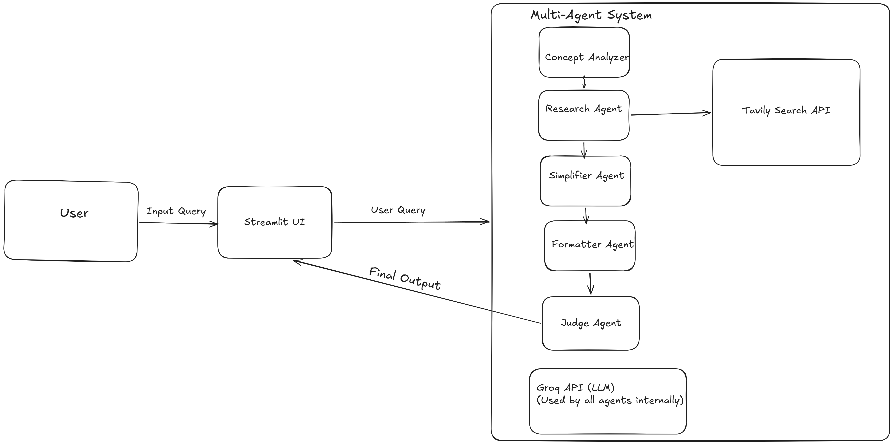

# 🤖 ELI5 – Learn Anything Simply

Clear explanations in the simplest possible way using a multi-agent AI system.

---


## 🚀 Live Demo

👉 https://eli5-multi-agent-6yco7cu8dmitahfmzdqg4y.streamlit.app/

## 🎥 Demo Video

👉 https://www.loom.com/share/8d945d52a5d44261bdf161205c3c78a3
---

## 📌 Problem

Most explanations online are complex and hard to understand, especially for beginners.

---

## 💡 Solution

This app explains any topic in a simple, structured **“Explain Like I’m 5” (ELI5)** format using a multi-agent AI system.

---

## 🧠 Architecture



Multi-Agent System Flow:
- Concept Analyzer → Understands the user query  
- Research Agent → Fetches real-time data using Tavily API  
- Simplifier Agent → Converts complex info into simple language  
- Formatter Agent → Structures the output  
- Judge Agent → Ensures quality and clarity  
👉 All agents use **Groq LLM** for reasoning and generation.

---

## ⚙️ Tech Stack

* Python
* Streamlit
* Groq API
* Tavily API

---

## ✨ Features

* Multi-agent reasoning
* Real-time web research
* Structured explanations
* Beginner-friendly UI

---

## 🧪 Example

**Input:**

```
explain ai
```

**Output:**

* Idea
* Explanation
* Example
* Why it matters

---

## 🔧 Setup

### 1. Clone the repository

```
git clone https://github.com/24luten-debug/eli5-multi-agent.git
cd eli5-multi-agent
```

---

### 2. Install dependencies

```
pip install -r requirements.txt
```

---

### 3. Create `.env` file

```
GROQ_API_KEY=your_key
TAVILY_API_KEY=your_key
```

---

### 4. Run the app

```
streamlit run app.py
```

---

## 📂 Project Structure

```
eli5-agent/
│── app.py
│── requirements.txt
│── README.md
│── .env (not pushed to GitHub)
```

---

## 👨‍💻 Authors

* Nishad Lute
* Om Pande

---

## 🤝 Collaboration

This project was developed as a team project using GitHub collaboration features.

---

## 📌 Note

* API keys are stored securely using `.env`
* `.env` file is excluded using `.gitignore`

---

## ⭐ Future Improvements

* Add voice input
* Add more agent roles
* Improve UI/UX
* Add history feature

---

## 🎯 Conclusion

This project demonstrates how a multi-agent AI system can simplify complex topics into easy-to-understand explanations for everyone.

---
